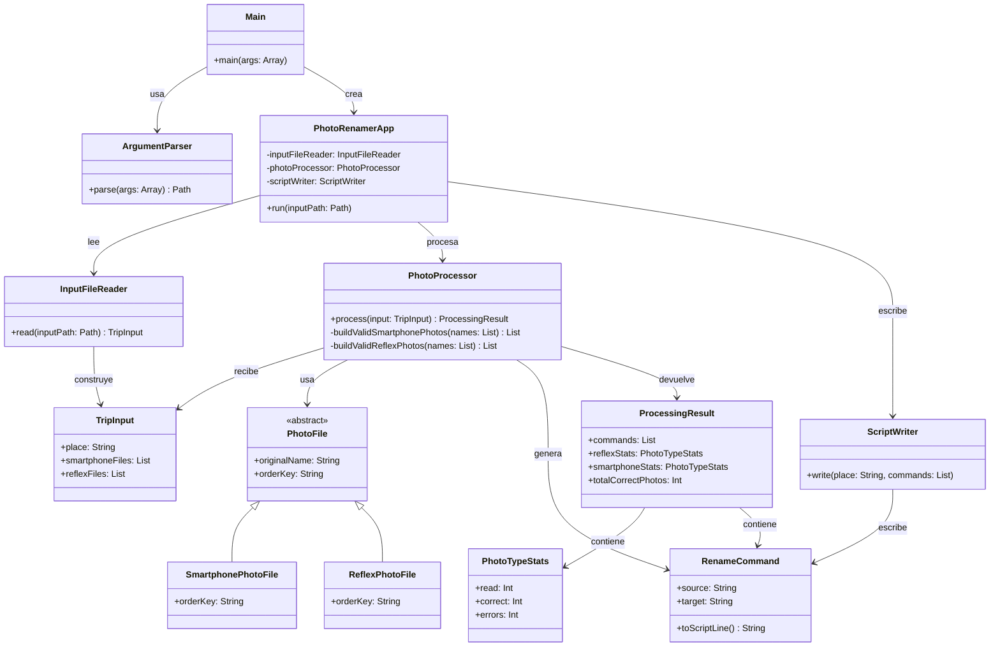
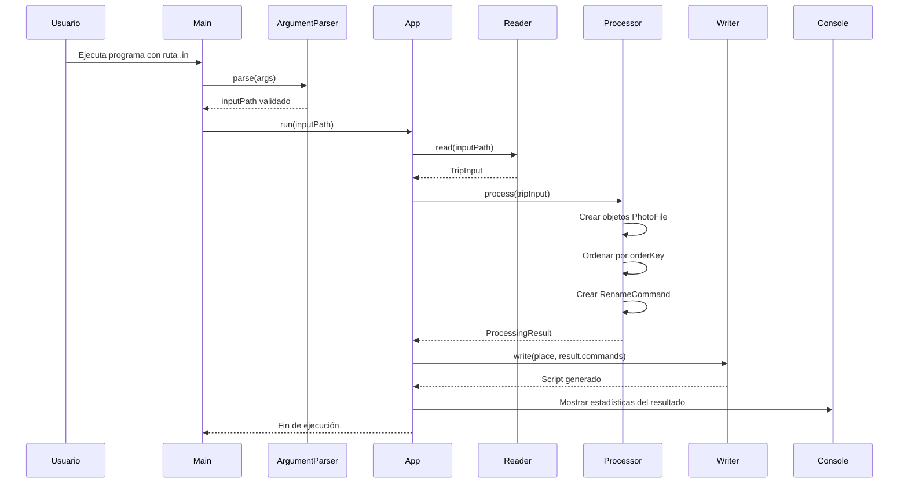
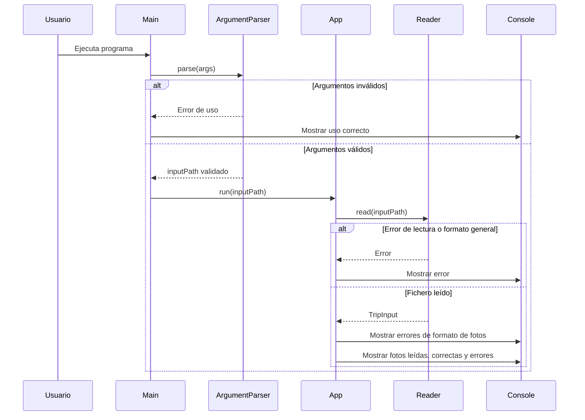
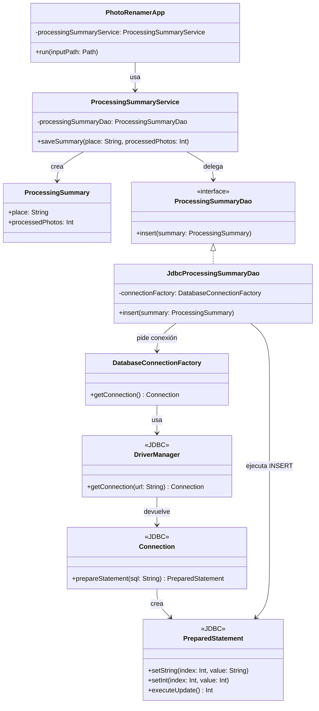
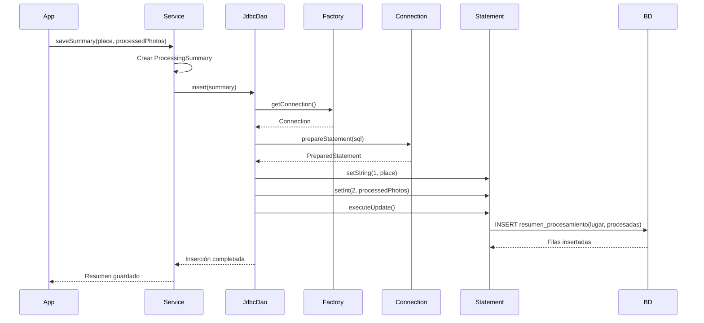
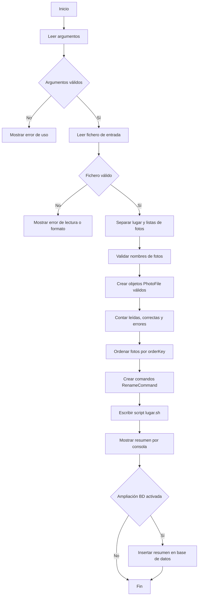
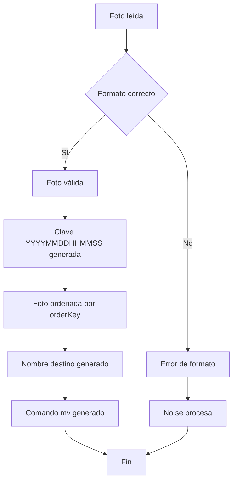

# Diagramas de la solución

Este documento recoge varios diagramas Mermaid para explicar la arquitectura propuesta, el flujo principal de ejecución y la ampliación de base de datos.

## Diagrama de clases de la solución base

Este diagrama representa las clases principales y sus relaciones.

## Diagrama de secuencia de `PhotoRenamerApp`

## Diagrama de secuencia con errores de entrada

## Diagrama de clases de la extensión de base de datos

Este diagrama muestra la ampliación para alumnado que tenga asociada la parte de base de datos. Solo se implementa el `insert`; el resto del CRUD queda para la pregunta teórica.

## Diagrama de secuencia de la extensión JDBC

## Diagrama de flujo del procesamiento

## Diagrama de estados de una foto durante el procesamiento

